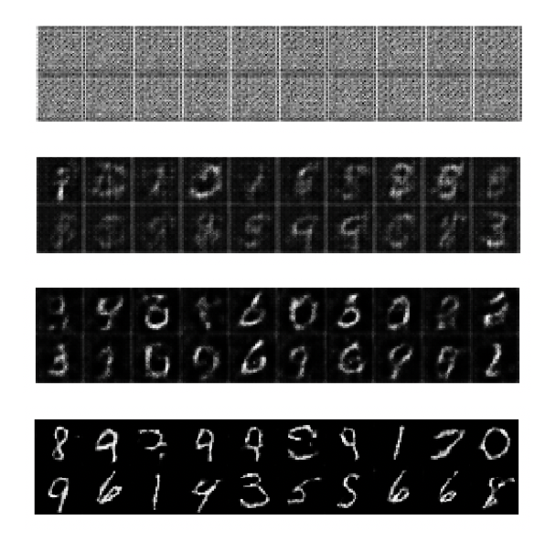
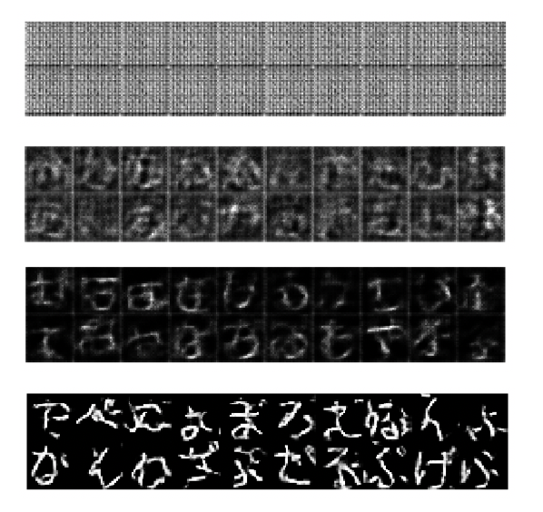

# Minimal sample code for TFGAN

## What is this?

[TensorFlow Models](https://github.com/tensorflow/models) is a quite nice tutorial. You can find a TFGAN example at [models/research/gan/](https://github.com/tensorflow/models/tree/master/research/gan). There is a Jupyter Notebook `tutorial.ipynb`. You can enjoy TFGAN just by executing cell by cell. Then you will obtain generated images of MNIST. ...Then you would be at a loss at what to do next. I did.

So I extract minimum codes from the tutorial which contains just two files with 270 lines. I hope it would help you to understand TFGAN and to go forward.

## How to use

Just run `make`. Or you can execute step by step.

```sh
python prepare_data.py
python gan_test.py
```

Then you will have generated images from `gen000.png` to `gen063.png`. It will take 10 - 15 minites.

Here are generated images.



You can see that the generated images becomes clearer and clearer as learning proceeds.

If you want, you can make an animation GIF file with ImageMagick as follow.

```sh
convert -delay 10 -loop 0 gen*.png mnist.gif
```

## Hiragana

You can also generate Hiragana. You need a font file `ipaexg.ttf`. You should download it from [IPA](https://ipafont.ipa.go.jp/old/ipafont/download.html) and place it at the same directory.

Generate training data for Hiragana.

```py
python hiragana.py
```

It will generates `hiragana.tfrecord`.

Change the following line in `gan_test.py` as,

```py
#TRAIN_DATA = 'mnist_train.tfrecord'
TRAIN_DATA = 'hiragana.tfrecord'
```

and execute it.

```py
python gan_test.py
```

You will obtain the generated images something like these.



## License

The source codes in this repository are available under Apache 2.0 License. See [LICENSE](LICENSE) for details.

The file `hiragana.py` was written by me. The rest of programs, `gan_test.py` and `prepare_data.py` are just extracted ones from [TensorFlow Models](https://github.com/tensorflow/models). So the copyright holders are TensorFlow Authors.